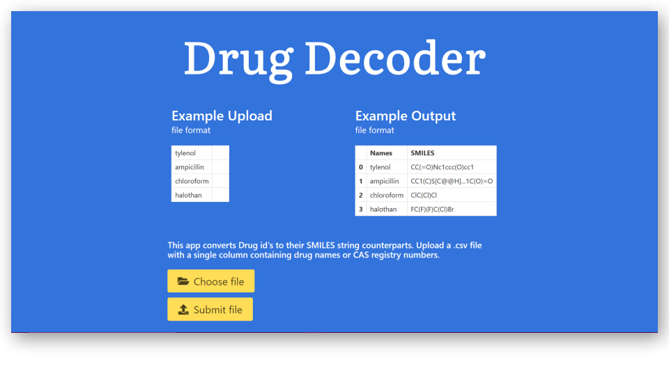

# Drug-Decode - Drug name to SMILES conversion

# [The app can be found here!](http://www.drug-decode.appspot.com/)

I made this app as practice for learning Flask and web-app development. The app takes common drug names and attempts to convert them to their SMILES string counterparts. The input file must be in CSV format and contain only one column. There are drugs that do not convert and I'm currently working on having these negative results output to a second file. Another function to add is a text form where a single drug can be converted immediately to a SMILES string. Lastly, I'd like to add CAS number to SMILES conversion.

